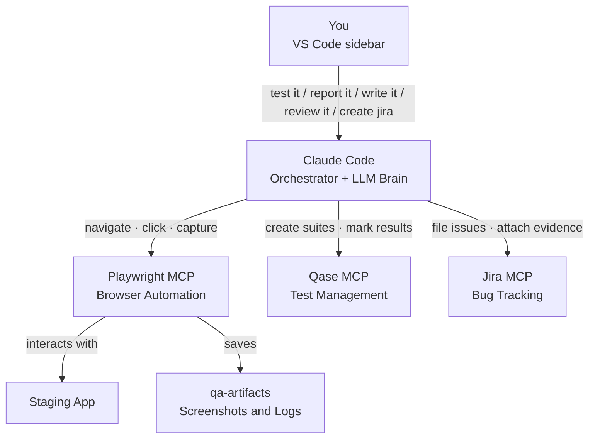
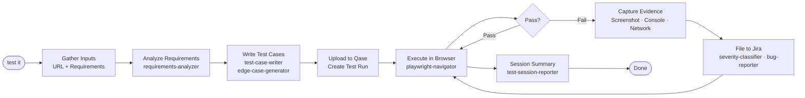
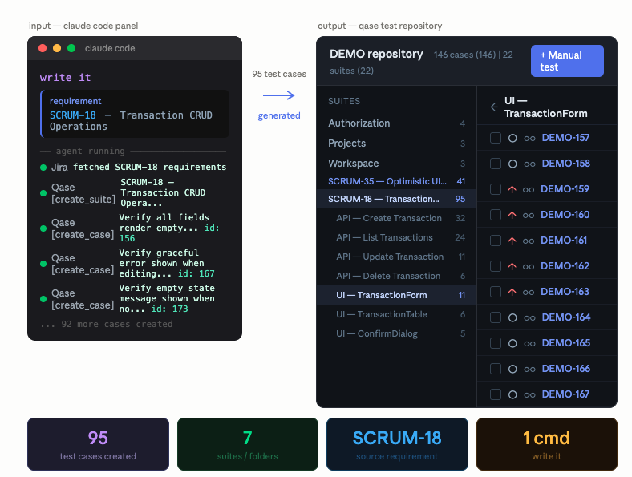
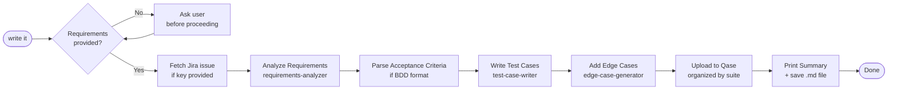
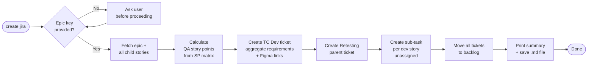

# Senior QA Engineer Agent

An autonomous QA agent that runs inside VS Code. Give it a staging URL and a feature description — it writes test cases, executes them in a real browser, finds bugs, files detailed Jira issues, and even creates your QA sprint tickets, all without you lifting a finger.

> Built with Claude Code · Playwright MCP · Qase · Jira

---

## What It Does

```
You: "test it — App: https://staging.myapp.com — Feature: User Login"

Agent:
  1. Reads your requirements (or fetches them from Jira)
  2. Writes test cases → uploads to Qase
  3. Opens a real browser → executes every test
  4. Finds bugs → captures screenshot + console + network logs
  5. Files detailed bug reports to Jira
  6. Closes the session with a full summary
```

Runs entirely inside VS Code. No extra tools, no dashboards, no context-switching.

---

## Five Modes

| Mode | Trigger | What Happens |
|------|---------|-------------|
| **WAY 1** — Full QA Session | `test it` | Full lifecycle: analyze → write test cases → execute → file bugs → summary |
| **WAY 2** — Quick Bug Report | `report it` | Parse your shorthand input → format → file to Jira → print summary |
| **WAY 3** — Write Test Cases | `write it` | Analyze requirements → generate test cases → upload to Qase → summary |
| **WAY 4** — Review Test Cases | `review it` | Audit & improve existing Qase suite → fix fields → fill gaps → summary |
| **WAY 5** — Create QA Jira Tickets | `create jira` | Fetch epic → create Test Case Dev ticket + Retesting parent + sub-tasks → move to backlog |

---

## Architecture



---

## Knowledge Base — the agent's product memory

By default an AI test agent starts every session cold: it only knows the feature description and staging URL you give it that run. The `knowledge-base/` folder fixes that — it's persistent product memory the agent loads automatically before analyzing any requirements (WAY 1, 3, 4).

**Knowledge is per-product; skills are global.** Sub-agents in `.claude/agents/` are *how* to test (shared everywhere). The knowledge base is *what* a specific product does — so each product gets its own folder, named by its **Qase project code** and auto-selected by the active profile. Beevo's rules never leak into a Showcase session.

```
knowledge-base/
├── _TEMPLATE/     ← copy to start a new product KB
├── LSY/           ← Profile 2 (Beevo)
├── SWC/           ← Profile 3 (Showcase)
└── AD/            ← Profile 4 (Showcase AD)
```

Start a product's KB by copying the template (use your Qase project code):

```bash
cp -r knowledge-base/_TEMPLATE knowledge-base/SWC
```

| File | Answers | What it changes |
|------|---------|-----------------|
| `product-flows.md` | How do users actually move through the product? | Grounds happy-path tests in real navigation, not guesses |
| `business-rules.md` | What is allowed, forbidden, or enforced? | **The bug-vs-intended oracle** — a rule here is authoritative truth, outranking heuristic guesses |
| `feature-map.md` | What depends on what? | Adds regression-risk areas (a feature's `Used by` chain) to every test scope |
| `known-defects.md` | Where has this product broken before? | Probes historical weak spots harder; prevents duplicate bug reports |

**It compounds.** At the end of every WAY 1 session the agent proposes knowledge-base updates for that product — new confirmed defects, new flows, new rules learned — so each run leaves it smarter for the next. You can also just tell it a fact ("the upload limit is now 20 MB") and it files it into the right product's KB.

**Why it matters:** with the knowledge base, the agent can tell a *confirmed* defect (violates a documented `BR-xx` rule) from a *suspected* one (heuristic only), avoids re-filing known bugs, and widens coverage into connected features. Start with a few entries per file — even a small KB makes the agent noticeably sharper. It's optional and additive: if a product has no folder yet, the agent falls back to spec-only analysis. See `knowledge-base/README.md` for the format.

---

## Tech Stack

| Tool | Role | Cost |
|------|------|------|
| [VS Code](https://code.visualstudio.com) + [Claude Code Extension](https://marketplace.visualstudio.com/items?itemName=Anthropic.claude-code) | IDE + agent orchestrator | Free + $20/mo (Claude Pro) |
| Claude Sonnet (Anthropic) | LLM brain — reasoning, test generation, bug analysis | Included with Claude Pro |
| [Playwright MCP](https://github.com/microsoft/playwright-mcp) | Browser automation, screenshots, logs | Free |
| [Qase MCP](https://github.com/qase-tms/qase-mcp-server) | Upload test cases, manage runs, mark results | Free tier available |
| [mcp-atlassian](https://github.com/sooperset/mcp-atlassian) | File Jira issues, create tickets | Free |

**Estimated total: ~$20/month** (Claude Pro covers everything)

---

## Project Structure

```
qa-agent/
├── CLAUDE.md                          # Agent brain — full workflow + trigger keywords
├── README.md                          # This file
├── knowledge-base/                    # Persistent product memory — one folder per product
│   ├── _TEMPLATE/                     # Copy this to start a new product's KB
│   │   ├── product-flows.md           # Real navigation flows
│   │   ├── business-rules.md          # Authoritative bug-vs-intended oracle
│   │   ├── feature-map.md             # Feature dependencies / blast radius
│   │   └── known-defects.md           # Historical weak spots + filed tickets
│   └── <QASE_PROJECT>/                # e.g. LSY/, SWC/, AD/ — auto-selected by profile
├── .env.example                       # Template — copy to .env and fill in your tokens
├── .mcp.example.json                  # Template — copy to .mcp.json and fill in your tokens
├── .mcp.json                          # Active MCP config (gitignored — created from .mcp.example.json)
├── .vscode/
│   └── mcp.json                       # MCP config for VS Code extension (uses ${env:VAR})
├── .claude/
│   ├── settings.example.json          # Template — copy to settings.json and fill in
│   ├── settings.json                  # Active settings (gitignored)
│   ├── settings.p1.json               # Profile 1 credentials (gitignored)
│   ├── settings.p2.json               # Profile 2 credentials (gitignored)
│   ├── mcp.p1.example.json            # Profile 1 MCP template
│   └── agents/                        # 10 specialist sub-agents (skills)
│       ├── requirements-analyzer/
│       ├── acceptance-criteria-parser/
│       ├── test-case-writer/
│       ├── test-case-reviewer/
│       ├── edge-case-generator/
│       ├── playwright-navigator/
│       ├── bug-reporter/
│       ├── severity-classifier/
│       ├── test-session-reporter/
│       └── issue-reporter/
├── qa-artifacts/                      # Created locally — gitignored
│   ├── screenshots/
│   ├── console-logs/
│   ├── network-logs/
│   └── logs/
└── credentials/                       # Created locally — gitignored
    └── google-sa.json                 # Google service account (Profile 4 only)
```

Files excluded from git: `.env`, `.mcp.json`, `.claude/settings.json`, `.claude/settings.p*.json`, `.claude/mcp.p*.json`, `credentials/`, `qa-artifacts/`

---

## Setup

### 1. Prerequisites

| Requirement | Version | Install |
|-------------|---------|---------|
| VS Code | Latest | [code.visualstudio.com](https://code.visualstudio.com) |
| Claude Code Extension | Latest | VS Code Extensions → search "Claude Code" |
| Node.js | 18+ | [nodejs.org](https://nodejs.org) |
| Claude Pro account | — | Required for Claude Code |

### 2. Clone the repo

```bash
git clone https://github.com/your-username/qa-agent.git
cd qa-agent
```

### 3. Install Playwright browser

```bash
npx playwright install chromium
```

### 4. Get your API tokens

| Service | How to get the token |
|---------|---------------------|
| **Jira** | [id.atlassian.com](https://id.atlassian.com) → Security → API Tokens → Create |
| **Qase** | [app.qase.io](https://app.qase.io) → Settings → API Tokens → Generate |

You also need:
- Your **Jira workspace URL** (e.g. `https://yourcompany.atlassian.net`)
- Your **Jira project key** (e.g. `SCRUM`) — visible in the Jira board URL
- Your **Qase project code** (e.g. `DEMO`) — visible in Qase project settings

### 5. Create your config files

```bash
cp .env.example .env
cp .mcp.example.json .mcp.json
cp .claude/settings.example.json .claude/settings.json
```

Open `.mcp.json` and fill in your tokens:

```json
{
  "mcpServers": {
    "qase": {
      "env": { "QASE_API_TOKEN": "your_qase_api_token_here" }
    },
    "jira": {
      "env": {
        "JIRA_URL": "https://yourcompany.atlassian.net",
        "JIRA_USERNAME": "your@email.com",
        "JIRA_API_TOKEN": "your_jira_api_token_here"
      }
    }
  }
}
```

Open `.claude/settings.json` and fill in the same values under the `env` key:

```json
"env": {
  "JIRA_URL": "https://yourcompany.atlassian.net",
  "JIRA_USERNAME": "your@email.com",
  "JIRA_API_TOKEN": "your_jira_api_token",
  "JIRA_PROJECT": "YOUR_PROJECT_KEY",
  "QASE_API_TOKEN": "your_qase_api_token",
  "QASE_PROJECT": "YOUR_QASE_PROJECT_CODE"
}
```

> **Why two files?** `.mcp.json` is read by the MCP server processes at startup. `settings.json` is read by Claude Code to pass the same tokens as environment variables. Both need the same values.

### 6. Create artifact directories

```bash
mkdir -p qa-artifacts/screenshots qa-artifacts/console-logs qa-artifacts/network-logs qa-artifacts/logs
```

### 7. Open in VS Code

```bash
code .
```

The Claude Code panel appears in the sidebar. All three MCP servers (Playwright, Qase, Jira) start automatically on first use.

### 8. Verify MCP servers

In the Claude Code panel, type `/mcp` to confirm all three servers show as connected:
- `playwright` — browser automation
- `qase` — test case management
- `jira` — bug tracking

If any server fails, check that your tokens in `.mcp.json` and `settings.json` are correct and match.

---

### Multiple Profiles (optional)

> **Note:** If you only work with one Jira and one Qase workspace, you don't need profiles at all — the credentials you set in `settings.json` and `.mcp.json` during setup are enough. Profiles are only useful when you switch between different workspaces regularly.

If you test against multiple Jira/Qase workspaces, create one settings file per profile:

```bash
cp .claude/settings.example.json .claude/settings.p1.json
cp .claude/settings.example.json .claude/settings.p2.json
cp .claude/mcp.p1.example.json .claude/mcp.p1.json
```

Fill each file with the credentials for that workspace. Switch profiles by saying the profile name at the start of any command — the agent copies the right file automatically:

```
Profile 1, test it
App: https://staging.myapp.com
Feature: Login
```

| Profile | Jira | Qase |
|---------|------|------|
| Profile 1 | yourcompany.atlassian.net / PROJECT-KEY | PROJECT-CODE |
| Profile 2 | yourcompany.atlassian.net / PROJECT-KEY | PROJECT-CODE |
| Profile 3 | yourcompany.atlassian.net / PROJECT-KEY | PROJECT-CODE |
| Profile 4 | yourcompany.atlassian.net / PROJECT-KEY | PROJECT-CODE + Google Docs/Sheets |

---

### Google Docs / Sheets (optional, Profile 4)

Only needed if you want the agent to read requirements from a Google Doc or Sheet.

1. Create a Google Cloud service account and download the JSON key
2. Save it as `credentials/google-sa.json`
3. Add to `settings.json` env:
```json
"GOOGLE_APPLICATION_CREDENTIALS": "./credentials/google-sa.json",
"GOOGLE_DOC_ID": "your_doc_id_from_the_url"
```

---

## Usage

### WAY 1 — Full QA Session

**From plain text requirements:**
```
test it
App: https://staging.myapp.com
Feature: Document Upload
Requirements:
1. Users can upload PDF and DOCX files only
2. Files over 10MB are rejected with a clear error
3. Uploaded files appear in the document list immediately
```

**From a Jira story:**
```
test it
App: https://staging.myapp.com
Jira: PROJ-42
```

**What it produces:**
- Qase test run with pass/fail/blocked results
- Jira bug reports with numbered repro steps, screenshots, console + network logs
- Session report saved to `qa-artifacts/session-YYYY-MM-DD-HH-MM.md`



---

### WAY 2 — Quick Bug Report

```
report it
Admin Portal, Must be logged in, Go to Settings > Click Delete Account > Confirm > Observe: page shows 500 error instead of success message
```

Input format: `[Portal], [Precondition], [Step 1 > Step 2 > Observe: what you saw]`

**What it produces:**
- Jira bug filed immediately with precondition, steps, actual + expected result, priority
- Summary printed to chat: Jira key, title, priority, assignee, direct Jira link


---

### WAY 3 — Write Test Cases Only

Use this before the feature is ready for browser testing — generates and uploads test cases to Qase from requirements alone.

**From plain text:**
```
write it
Requirements:
1. Users can upload PDF and DOCX files only
2. Files over 10MB are rejected with a clear error
3. Uploaded files appear in the document list immediately
```

**From a Jira story:**
```
write it
Jira: PROJ-42
```

**With optional context:**
```
write it
Jira: PROJ-42
App: https://staging.myapp.com/upload
Figma: https://figma.com/file/abc123/Upload-Flow
```

Optional params:
- `App:` — feature URL for UI-aware test step wording
- `Figma:` — design reference linked in test case notes
- `Screenshot:` — path to a screenshot of current UI state

**What it produces:**
- Qase test cases organized into suites by area
- Summary saved to `qa-artifacts/testcases-YYYY-MM-DD-HH-MM.md`





---

### WAY 4 — Review Existing Test Cases

Audits an existing Qase suite against requirements, fixes every field, and creates new test cases for any missing scenarios.

```
review it
Suite: https://app.qase.io/project/PROJ/suite/5
Jira: PROJ-42
```

```
review it
Suite: https://app.qase.io/project/PROJ/suite/5
App: https://staging.myapp.com/upload
```

**What it reviews per test case:**
- **Title** — rewritten to `Verify [outcome] when [condition]` format
- **Severity & Priority** — corrected to match business impact (Severity × Priority matrix)
- **Type** → forced to `Regression`
- **Layer** → forced to `E2E`
- **Behavior** → classified as `Positive` or `Negative`
- **Precondition** — expanded if vague; personal data removed (data belongs in Test Data field only)
- **Steps** — one action per step, imperative form, observation step at end
- **Expected Result** — added to every step that's missing it
- **Test Data** — placeholder values added where input is required
- **Grammar & Spelling** — fixed throughout

**What it produces:**
- Updated test cases in Qase (every field corrected)
- New test cases for any missing scenarios
- Review report saved to `qa-artifacts/review-YYYY-MM-DD-HH-MM.md`


---

### WAY 5 — Create QA Jira Tickets from Epic

Reads a dev epic, calculates QA story points from the dev SP matrix, and creates all QA tickets ready for sprint planning — without you touching Jira manually.

```
create jira
Epic: PROJ-100
```

**What it creates:**
- **1 Test Case Development ticket** — aggregated requirements + Figma links from all child stories
- **1 Retesting parent ticket** — one sub-task per dev story, all unassigned
- All tickets moved to backlog so you can pull them into the sprint manually

Story points are calculated automatically from the dev story SPs using built-in matrices.

**What it produces:**
- All tickets created in Jira under the epic
- Summary printed to chat and saved to `qa-artifacts/jira-tickets-YYYY-MM-DD-HH-MM.md`



---

## Example Output

### Bug Report Filed to Jira

```
[File Upload] 15MB file accepted despite 10MB limit

## Steps to Reproduce
1. Navigate to https://staging.myapp.com/documents
2. Click "Upload Document"
3. Select a 15MB PDF file
4. Click "Save"
5. Observe: file uploads successfully with no error message

## Expected Result
Upload rejected with error: "File size exceeds the 10MB limit"

## Actual Result
15MB file accepted and appears in the document list

## Environment
- URL: https://staging.myapp.com/documents
- Browser: Chromium 124
- Date: 2026-05-21T10:32:00Z

## Artifacts
- Screenshot: failure-001.png (attached)
- Network log: net-001.json (attached)
```

---

## Sub-Agents

Each skill is a specialized instruction file that gives the agent expert-level knowledge for one phase of testing.

| Skill | Used In | What It Does |
|-------|---------|-------------|
| `requirements-analyzer` | WAY 1, 3 | Breaks specs into happy paths, edge cases, security scenarios |
| `acceptance-criteria-parser` | WAY 1, 3 | Converts BDD / user-story criteria into pass/fail conditions |
| `test-case-writer` | WAY 1, 3 | Generates Qase test cases with steps, preconditions, expected results |
| `edge-case-generator` | WAY 1, 3 | Adds boundary values, injection payloads, encoding attacks |
| `playwright-navigator` | WAY 1, 4 | Executes tests in browser, manages waits, captures failures |
| `bug-reporter` | WAY 1 | Files complete Jira reports: repro steps + expected/actual + artifacts |
| `severity-classifier` | WAY 1 | Two-axis severity × priority model with auto-escalation for security bugs |
| `test-session-reporter` | WAY 1 | Closes session, updates Qase, generates stakeholder report |
| `issue-reporter` | WAY 2 | Parses shorthand input → formats → files Jira bug immediately |
| `test-case-reviewer` | WAY 4 | Audits existing Qase suite — fix fields, grammar, gaps; create missing cases |

---

## Troubleshooting

| Problem | Fix |
|---------|-----|
| Jira MCP 401 error | Check `JIRA_URL`, `JIRA_USERNAME`, `JIRA_API_TOKEN` in `.mcp.json` and `settings.json` |
| Qase MCP auth fails | Regenerate token in Qase → Settings → API Tokens |
| Agent goes off-task | Ensure `CLAUDE.md` is in the project root; reload VS Code window |
| Screenshots not saved | Check `qa-artifacts/screenshots/` exists and is writable |
| MCP server not connecting | Type `/mcp` in Claude Code panel to verify server status |
| Profile switch not working | Ensure `settings.pN.json` and `mcp.pN.json` exist in `.claude/` with correct credentials |

---

## License

MIT — use freely, attribution appreciated.
