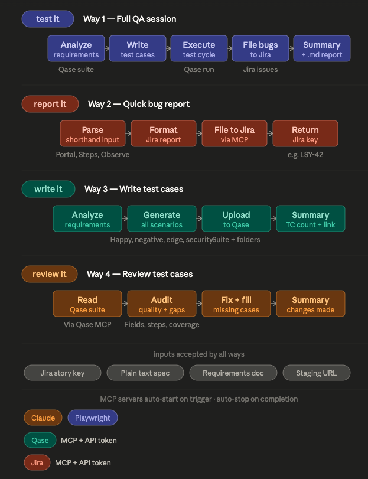
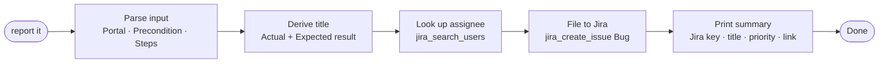
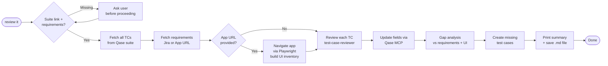

# Senior QA Engineer Agent

An autonomous QA agent that runs inside VS Code. Give it a staging URL and a feature description — it writes test cases, executes them in a real browser, finds bugs, and files detailed Jira issues, all without you lifting a finger.

> Built with Claude Code · Playwright MCP · Qase · Jira

---

## What It Does

```
You: "test it — App: https://staging.myapp.com — Feature: User Login"

Agent:
  1. Reads your requirements (or fetches them from Jira)
  2. Writes test cases → uploads to Qase
  3. Opens a real browser → executes every test
  4. Finds bugs → captures screenshot + console + network logs
  5. Files detailed bug reports to Jira
  6. Closes the session with a full summary
```

---

## Architecture


---

## Four Modes

| Mode | Trigger | What Happens |
|------|---------|-------------|
| **WAY 1** — Full QA Session | `test it` | Full lifecycle: analyze → write test cases → execute → file bugs → summary |
| **WAY 2** — Quick Bug Report | `report it` | Parse your shorthand input → format → file to Jira → print summary |
| **WAY 3** — Write Test Cases | `write it` | Analyze requirements → generate test cases → upload to Qase → summary |
| **WAY 4** — Review Test Cases | `review it` | Audit & improve existing Qase suite → fix fields → fill gaps → summary |



---

## WAY 1 — Full Session Flow


## WAY 2 — Quick Bug Report Flow



---

## Tech Stack

| Tool | Role | Cost |
|------|------|------|
| [VS Code](https://code.visualstudio.com) + [Claude Code Extension](https://marketplace.visualstudio.com/items?itemName=Anthropic.claude-code) | IDE + agent orchestrator | Free + $20/mo (Claude Pro) |
| Claude Sonnet (Anthropic) | LLM brain — reasoning, test generation, bug analysis | Included with Claude Pro |
| [Playwright MCP](https://github.com/microsoft/playwright-mcp) | Browser automation, screenshots, logs | Free |
| [Qase MCP](https://github.com/qase-tms/qase-mcp-server) | Upload test cases, manage runs, mark results | Free tier available |
| [mcp-atlassian](https://github.com/sooperset/mcp-atlassian) | File Jira issues with attachments | Free |

**Estimated total: ~$20/month** (Claude Pro covers everything)

---

## Project Structure

```
qa-agent/
├── CLAUDE.md                          # Agent brain — full workflow + trigger keywords
├── README.md                          # This file
├── .env.example                       # Template — copy to .env and fill in your tokens
├── .mcp.example.json                  # Template — copy to .mcp.json and fill in your tokens
├── .mcp.json                          # MCP server config (gitignored — created from .mcp.example.json)
├── .vscode/
│   └── mcp.json                       # MCP server config for VS Code extension
├── .claude/
│   ├── settings.example.json          # Template — copy to settings.json and fill in
│   └── agents/                        # 11 specialist sub-agents (skills)
│       ├── requirements-analyzer/
│       ├── acceptance-criteria-parser/
│       ├── test-case-writer/
│       ├── test-case-reviewer/
│       ├── edge-case-generator/
│       ├── playwright-navigator/
│       ├── bug-reporter/
│       ├── severity-classifier/
│       ├── test-session-reporter/
│       ├── issue-reporter/
│       └── exploratory-tester/
├── qa-artifacts/                      # Created locally — gitignored
│   ├── screenshots/
│   ├── console-logs/
│   ├── network-logs/
│   └── logs/
└── credentials/                       # Created locally — gitignored
    └── google-sa.json                 # Google service account (Profile 4 only)
```

Files excluded from git: `.env`, `.mcp.json`, `.claude/settings.json`, `.claude/settings.p*.json`, `credentials/`, `qa-artifacts/`, `.playwright-mcp/`

---

## Sub-Agents (Skills)

Each skill is a specialized instruction file that gives the agent expert-level knowledge for one phase of testing.

| Skill | Phase | What It Does |
|-------|-------|-------------|
| `requirements-analyzer` | Phase 1 | Breaks specs into happy paths, edge cases, security scenarios |
| `acceptance-criteria-parser` | Phase 1 | Converts BDD / user-story criteria into pass/fail conditions |
| `test-case-writer` | Phase 2 | Generates Qase test cases with steps, preconditions, expected results |
| `edge-case-generator` | Phase 2 | Adds boundary values, injection payloads, encoding attacks |
| `playwright-navigator` | Phase 3 | Executes tests in browser, manages waits, captures failures |
| `bug-reporter` | Phase 4 | Files complete Jira reports: repro steps + expected/actual + artifacts |
| `severity-classifier` | Utility | Two-axis severity × priority model with auto-escalation for security bugs |
| `test-session-reporter` | Utility | Closes session, updates Qase, generates stakeholder report |
| `issue-reporter` | WAY 2 | Parses shorthand input → formats → files Jira bug immediately |
| `requirements-analyzer` + `test-case-writer` + `edge-case-generator` | WAY 3 | Write & upload test cases to Qase from requirements only |
| `test-case-reviewer` | WAY 4 | Audit existing Qase suite — fix fields, grammar, gaps; create missing cases |

---

## Setup

### 1. Prerequisites

| Requirement | Version | Install |
|-------------|---------|---------|
| VS Code | Latest | [code.visualstudio.com](https://code.visualstudio.com) |
| Claude Code Extension | Latest | VS Code Extensions → search "Claude Code" |
| Node.js | 18+ | [nodejs.org](https://nodejs.org) |
| Claude Pro account | — | Required for Claude Code |

### 2. Clone the repo

```bash
git clone https://github.com/your-username/qa-agent.git
cd qa-agent
```

### 3. Install Playwright browser

```bash
npx playwright install chromium
```

### 4. Get your API tokens

| Service | How to get the token |
|---------|---------------------|
| **Jira** | [id.atlassian.com](https://id.atlassian.com) → Security → API Tokens → Create |
| **Qase** | [app.qase.io](https://app.qase.io) → Settings → API Tokens → Generate |

You also need:
- Your **Jira workspace URL** (e.g. `https://yourcompany.atlassian.net`)
- Your **Jira project key** (e.g. `SCRUM`) — visible in Jira board URL
- Your **Qase project code** (e.g. `DEMO`) — visible in Qase project settings

### 5. Create your `.env` and `.mcp.json` files

```bash
cp .env.example .env
cp .mcp.example.json .mcp.json
```

Open `.env` and fill in your values:

```env
JIRA_URL=https://yourcompany.atlassian.net
JIRA_USERNAME=your@email.com
JIRA_API_TOKEN=your_jira_api_token
JIRA_PROJECT=YOUR_PROJECT_KEY

QASE_API_TOKEN=your_qase_api_token
QASE_PROJECT=YOUR_QASE_PROJECT_CODE
```

### 6. Create your `settings.json` file

```bash
cp .claude/settings.example.json .claude/settings.json
```

Open `.claude/settings.json` and fill in the same values you put in `.env`:

```json
"env": {
  "JIRA_URL": "https://yourcompany.atlassian.net",
  "JIRA_USERNAME": "your@email.com",
  "JIRA_API_TOKEN": "your_jira_api_token",
  "JIRA_PROJECT": "YOUR_PROJECT_KEY",
  "QASE_API_TOKEN": "your_qase_api_token",
  "QASE_PROJECT": "YOUR_QASE_PROJECT_CODE"
}
```

> **Why two files?** `.env` is read by your shell. `settings.json` is read by Claude Code to pass tokens to the MCP servers (Jira, Qase). Both need the same values.

### 7. Create artifact directories

```bash
mkdir -p qa-artifacts/screenshots qa-artifacts/console-logs qa-artifacts/network-logs qa-artifacts/logs qa-artifacts/traces
```

### 8. Open in VS Code

```bash
code .
```

The Claude Code panel appears in the sidebar. All three MCP servers (Playwright, Qase, Jira) start automatically on first use.

### 9. Verify MCP servers

In the Claude Code panel, type `/mcp` to confirm all three servers show as connected:
- `playwright` — browser automation
- `qase` — test case management
- `jira` — bug tracking

If any server fails, check that your tokens in `settings.json` are correct.

---

### Multiple Profiles (optional)

If you test against multiple Jira/Qase workspaces, create one settings file per profile:

```bash
cp .claude/settings.example.json .claude/settings.p1.json
cp .claude/settings.example.json .claude/settings.p2.json
```

Fill each with different credentials. Switch profiles by saying "Profile 1" or "Profile 2" at the start of any command — the agent copies the right file automatically.

---

### Google Docs / Sheets (optional)

Only needed if you want the agent to read requirements from a Google Doc or Sheet.

1. Create a Google Cloud service account and download the JSON key
2. Save it as `credentials/google-sa.json`
3. Add to `settings.json`:
```json
"GOOGLE_APPLICATION_CREDENTIALS": "./credentials/google-sa.json",
"GOOGLE_DOC_ID": "your_doc_id_from_the_url"
```

---

## Usage

### Switching Profiles

Just mention the profile name at the start of any command — the agent switches automatically, no file editing needed:

```
Profile 1, test it
App: https://staging.myapp.com
Feature: Login

Profile 2, write it
Jira: PROJ-42

Profile 3, review it
Suite: https://app.qase.io/project/PROJ/suite/5
Jira: PROJ-10
```

| Profile | Jira | Qase | Google |
|---------|------|------|--------|
| Profile 1 | yourcompany.atlassian.net / PROJECT-KEY | PROJECT-CODE | — |
| Profile 2 | yourcompany.atlassian.net / PROJECT-KEY | PROJECT-CODE | — |
| Profile 3 | yourcompany.atlassian.net / PROJECT-KEY | PROJECT-CODE | — |
| Profile 4 | yourcompany.atlassian.net / PROJECT-KEY | PROJECT-CODE | Docs + Sheets |

---

### WAY 1 — Full QA Session

**From plain text requirements:**
```
test it
App: https://staging.myapp.com
Feature: Document Upload
Requirements:
1. Users can upload PDF and DOCX files only
2. Files over 10MB are rejected with a clear error
3. Uploaded files appear in the document list immediately
```

**From a Jira story:**
```
test it
App: https://staging.myapp.com
Jira: ABC-42
```

### WAY 2 — Quick Bug Report

```
report it
AP, Must be logged in, Go to Settings > Click Delete Account > Confirm > Observe: page shows 500 error instead of success message
```

Input format: `[Portal], [Precondition], [Step 1 > Step 2 > Observe: what you saw]`

---

### WAY 3 — Write Test Cases Only

**From plain text requirements:**
```
write it
Requirements:
1. Users can upload PDF and DOCX files only
2. Files over 10MB are rejected with a clear error
3. Uploaded files appear in the document list immediately
```

**From a Jira story:**
```
write it
Jira: SCRUM-42
```

**With optional context:**
```
write it
Jira: SCRUM-42
App: https://staging.myapp.com/upload
Figma: https://figma.com/file/abc123/Upload-Flow
```

Optional params (all can be omitted):
- `App:` — feature URL for UI-aware test step descriptions
- `Figma:` — design reference linked in test case notes
- `Screenshot:` — path to a screenshot of current UI state

WAY 3 uploads to Qase only — no browser, no Jira bugs. Use it before the feature is ready to test.


### WAY 3 Flow


---

### WAY 4 — Review Existing Test Cases

**From a Qase suite URL + Jira ticket:**
```
review it
Suite: https://app.qase.io/project/SWC/suite/5
Jira: XYZ-42
```

**From a Qase suite URL + app link:**
```
review it
Suite: https://app.qase.io/project/SWC/suite/5
App: https://staging.myapp.com/upload
```

What it reviews per test case:
- **Title** — rewritten to be clear and specific
- **Severity & Priority** — corrected to match business impact
- **Type** → forced to `Regression`
- **Layer** → forced to `E2E`
- **Behavior** → classified as `Positive` or `Negative`
- **Precondition** — expanded if vague or missing
- **Steps** — split, clarified, observation step added
- **Grammar & Spelling** — fixed throughout

After the review, missing scenarios are identified and new test cases are created in the same suite.

### WAY 4 Flow



---

## What the Agent Produces

**WAY 1 (Full QA session):**
- **Qase Test Run** — all test cases with pass/fail/blocked results
- **Jira Issues** — one per bug, with numbered repro steps, expected vs actual, environment block
- **Screenshots** — PNG capture at the exact moment of failure (`qa-artifacts/screenshots/`)
- **Console logs** — all `console.error` and `console.warn` during the test
- **Network logs** — HTTP requests/responses including API calls and status codes
- **Session report** — saved to `qa-artifacts/session-YYYY-MM-DD-HH-MM.md`

**WAY 2 (Quick bug report):**
- **Jira Bug** — filed immediately with precondition, steps, actual + expected result, priority, assignee
- **Summary** — Jira key, title, priority, assignee, and direct Jira link printed to chat

**WAY 3 (Write test cases):**
- **Qase test cases** — organized into suites, with steps, preconditions, expected results
- **Test case summary** — saved to `qa-artifacts/testcases-YYYY-MM-DD-HH-MM.md`

**WAY 4 (Review test cases):**
- **Updated Qase test cases** — Title, Severity, Priority, Type, Layer, Behavior, Precondition, Steps all corrected
- **New test cases** — created for any missing scenarios identified during gap analysis
- **Review report** — saved to `qa-artifacts/review-YYYY-MM-DD-HH-MM.md`

---

## Example Bug Report Filed to Jira

```
[File Upload] 15MB file accepted despite 10MB limit

## Steps to Reproduce
1. Navigate to https://staging.myapp.com/documents
2. Click "Upload Document"
3. Select a 15MB PDF file
4. Click "Save"
5. Observe: file uploads successfully with no error message

## Expected Result
Upload rejected with error: "File size exceeds the 10MB limit"

## Actual Result
15MB file accepted and appears in the document list

## Environment
- URL: https://staging.myapp.com/documents
- Browser: Chromium 124
- Date: 2026-05-21T10:32:00Z

## Artifacts
- Screenshot: failure-001.png (attached)
- Network log: net-001.json (attached)
```

---

## Troubleshooting

| Problem | Fix |
|---------|-----|
| Jira MCP 401 error | Check `JIRA_URL`, `JIRA_USERNAME`, `JIRA_API_TOKEN` in `.env` |
| Qase MCP auth fails | Regenerate token in Qase → Settings → API Tokens |
| Agent goes off-task | Ensure `CLAUDE.md` is in the project root; reload VS Code window |
| Screenshots not saved | Check `qa-artifacts/screenshots/` exists and is writable |
| MCP server not connecting | Type `/mcp` in Claude Code panel to verify server status |

---

## License

MIT — use freely, attribution appreciated.
